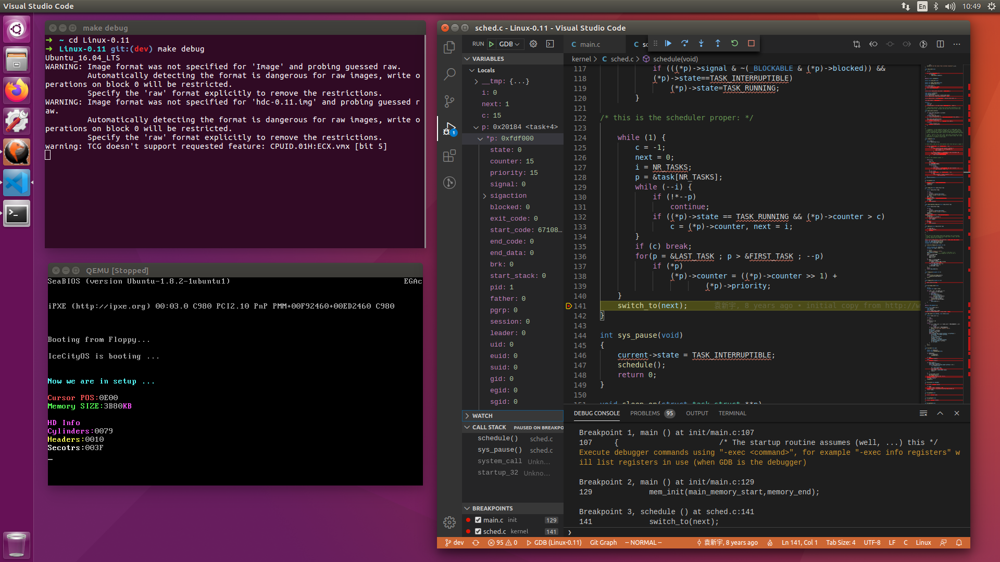

Linux-0.11
==========

The old Linux kernel source ver 0.11 which has been tested under modern Linux,  Mac OSX and Windows.

## 1. Build on Linux

### 1.1. Linux Setup

* a linux distribution: debian , ubuntu and mint are recommended
* some tools: gcc gdb qemu
* a linux-0.11 hardware image file: hdc-0.11.img, please download it from http://www.oldlinux.org, or http://mirror.lzu.edu.cn/os/oldlinux.org/, ant put it in the root directory.
* Now, This version already support the Ubuntu 16.04, enjoy it.

### 1.2. hack linux-0.11
```bash
$ make help		// get help
$ make  		// compile
$ make start		// boot it on qemu
$ make debug		// debug it via qemu & gdb, you'd start gdb to connect it.
```
```gdb
$ gdb tools/system
(gdb) target remote :1234
(gdb) b main
(gdb) c
```

Besides the raw gdb commands, you can use vscode to debug the kernel code step by step, *GDB Debug* extension is recommended. The configuration file is attached in folder *.vscode*.


## 2. Build on Mac OS X

### 2.1. Mac OS X Setup

* install cross compiler gcc and binutils
* install qemu
* install gdb. you need download the gdb source and compile it to use gdb because port doesn't provide i386-elf-gdb, or you can use the pre-compiled gdb in the tools directory.
* a linux-0.11 hardware image file: hdc-0.11.img

```bash
$ sudo port install qemu
$ sudo port install i386-elf-binutils i386-elf-gcc
```

optional
```bash
$ wget ftp://ftp.gnu.org/gnu/gdb/gdb-7.4.tar.bz2
$ tar -xzvf gdb-7.4.tar.bz2
$ cd gdb-7.4
$ ./configure --target=i386-elf
$ make
```

### 2.2. hack linux-0.11
same as section 1.2


## 3. Build on Windows
todo...

## 4. References

1. [Evolution of context-switch](https://sudonull.com/post/1409-The-evolution-of-x86-context-switching-in-Linux)
2. [Real-time signals](https://www.linuxprogrammingblog.com/all-about-linux-signals?page=9)
3. [Read Linux 0.11](https://github.com/theanarkh/read-linux-0.11)